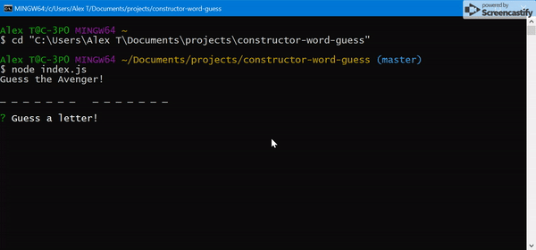

# Avengers Word Guess Game

Guess the Avenger in this CLI word guess game that uses the inquirer.js npm package

**Link to full demo:** https://drive.google.com/file/d/19fSoQhlg5hB2cY5xpLiBry-oGuewjxZa/view?usp=sharing

### Set Up

* Download the repository from GitHub
* Navigate to the directory containing the application in your terminal and simply run `npm install` to download the appropriate node modules files
* Then, still in the terminal, simply type `npm start` to start the game
* Type simply type `exit` at any time to exit the game

### Overview

A user is presented with a random Avenger to guess. They are prompted through inquirer to submit a letter and there guess is evaluated:

    * If the letter's in the word it will appear in the blanks
    * If the letter's not in the word you will lose 1 of 10 available guesses
    * If the letter's already been guessed it will tell you to guess another letter
    * If the user types in something other than a single letter they will be asked to type a letter
    * If the user guesses all the letters in the word you are congratulated and a new word will be selected for you to guess
    * If the user runs out of guesses they will be told they lost and will get to play another word
    

### Technologies Used

* Node.js
* ES6 Javascript with classes
* inquirer.js npm package
